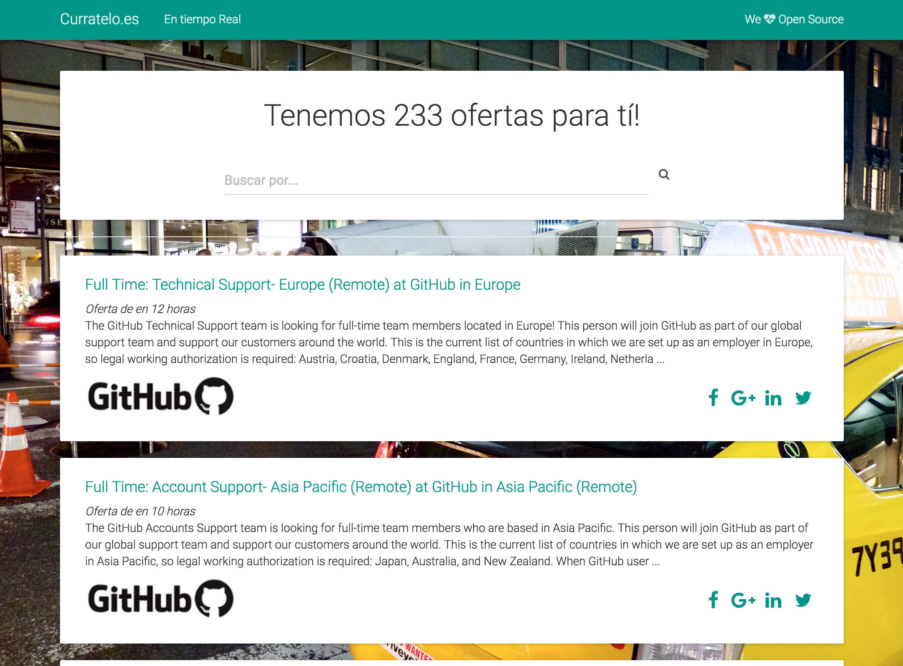
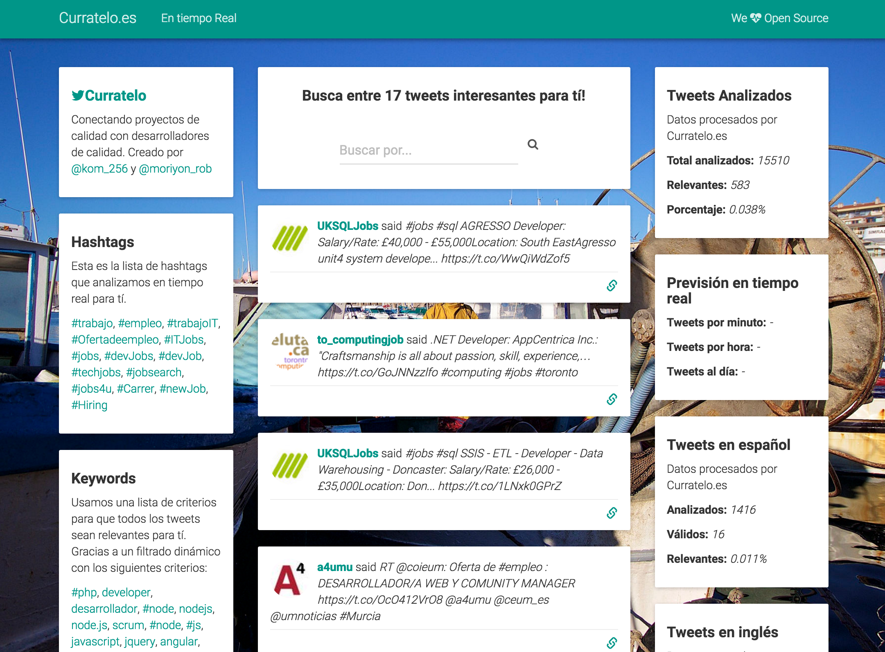

# Curratelo

### Ofertas de calidad para programadores de calidad

Portal **OpenSource** con ofertas de empleo de calidad para desarrolladores de calidad mantenido por [Ulises Gascón](https://twitter.com/kom_256) y [Roberto Moriyon](https://www.linkedin.com/in/moriyon)

Contacto Directo -> [@curratelo_Es en Twitter!](https://twitter.com/curratelo_Es)

### Funcionalidad: Ofertas de empleo

Descargamos las ofertas de empleo de diversos portales como Github, Stackoverflow, Domestika, etc... y te mostramos aquellas ofertas que lleven disponibles menos de dos días. También destacamos ofertas más especificas en función de ciertos criterios (salario, retos tecnológicos, tipo de empresa, etc..) que incluimos en el portal desde las lista de correo, meetups, etc. Mantenemos las ofertas destacadas 15 días como mucho.

También hosteamos ofertas propias, si quieres subir tu oferta ¡contáctanos!. 

### Funcionalidad: Streaming de Twitter

Analizamos los siguientes hashtags *#trabajo, #empleo, #trabajoIT, #Ofertadeempleo, #ITJobs, #jobs, #devJobs, #devJob, #techjobs, #jobsearch, #jobs4u, #Carrer, #newJob, #Hiring* y filtramos los tweets relevantes en base a ciertos criterios clave como *#php, developer, desarrollador, #node, nodejs, node.js, scrum, #node, #js, javascript, jquery, angular, frontend, front-end, python, django, backend, back-end...*

### IMPORTANTE

**Estamos con la versión Alpha en la web.**

Mientras tanto... nos encantaría que nos contaras que te parece el portal. 

Por supuesto estamos abiertos a mejoras y cambios por parte de la comunidad. **Esto es un proyecto opensource!**

La filosofía de este proyecto es ayudar a los desarrolladores con experiencia a encontrara trabajos que supongan un reto profesional y que destaquen frente a los típicos trabajos de la industria. Si crees que tus ofertas encajan en esta filosofía contáctanos e incluiremos tus ofertas en el sistema automático de publicación de [Curratelo.es](http://curratelo.es)

### Agradecimientos

**[Gaël Berthon](https://500px.com/gaelberthon)** por dejarnos usar sus increíbles fotografías.

### Arquitectura

Usamos en el Back (versión actual):
- [Pillarsjs](http://pillarsjs.com/) para gestionar el servidor HTTP
- [Scheduled](https://github.com/pillarsjs/scheduled) para gestionar tareas automatizadas
- [Node-rsj](http://hemanth.github.io/node-rsj/) para parsear RSS
- [Json-safe-parse](https://www.npmjs.com/package/json-safe-parse) para garantizar la integridad
- [x-ray](https://www.npmjs.com/package/x-ray) para scrapear ofertas de portales específicos
- [Firebase](https://www.npmjs.com/package/firebase) como base de datos
- [hangouts-bot](https://www.npmjs.com/package/hangouts-bot) para gestionar el servidor con Google Hnagouts
- [twitter](https://www.npmjs.com/package/twitter) para analizar la actividad de Twitter
- [slack-node](https://www.npmjs.com/package/slack-node) para mandar notificaciones e información sobre el servidor al grupo de Slack
- [jade](http://jade-lang.com/) como motor de plantillas

Usamos en el Front (versión actual):
- [Bootstrap](http://getbootstrap.com/)
- [Bootstrap Material Design](http://fezvrasta.github.io/bootstrap-material-design/)
- [list.js](http://www.listjs.com/)
- [Fuzzy Search](http://www.listjs.com/docs/plugins/fuzzysearch)
- [moment.js](http://momentjs.com/)
- Fotos como Background de [Gaël Berthon](https://500px.com/gaelberthon)

### BUGS:
- Problemas de rendimiento con el buscador en el index
- Problemas con el redireccionamiento DNS

### Cambios entre versiones.

**[v.0.0.2](https://github.com/UlisesGascon/curratelo/releases/tag/v.0.0.2-Alpha)**
- Información del sistema disponible de manera automatizada y a demanda
	- RAM, CPU, etc...
- Nuevas tareas automatizadas
	- Almacenaje de estadísticas de tweets analizados en Firebase
- Refactorización de las plantillas
- Organización de archivos temporales en la carpeta **/tmp**
- Implementación de Material Design con Bootstrap
- Gestión del servidor en tiempo real con Google Hangouts
- Gestión de notificaciones automatizada con Slack
- Análisis de Tweets en tiempo real
- Implementación de vistas en tiempo real con Socket.IO
- Nueva fuente de información (basada en scraping):
	- Domestika

**[v.0.0.1](https://github.com/UlisesGascon/curratelo/releases/tag/v.0.0.1-Alpha)**
- Base de datos principal Firebase
- Tareas automatizadas con Scheduled
- Fuentes de información nuevas (basadas en RSS):
  - Betabeers
  - GitHub
  - Stackoverflow
- Nuevas fuentes de información alternativas (basadas en Google Sheets)
